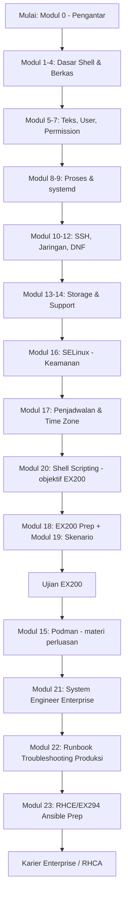

Selamat datang! Halaman ini adalah **peta jalan** agar kamu belajar efektif, tidak
asal loncat. Ikuti urutan, kerjakan LAB di tiap modul, dan uji diri dengan kuis.

> 📌 **EX200 saat ini resmi berbasis RHEL 10 (2026).** Yang diujikan = 11 area
> objektif resmi (essential tools, software + **Flatpak**, shell script, running
> systems, storage GPT/LVM, filesystems, deploy/timer/bootloader/chrony, networking
> IPv4+**IPv6**, users/groups, security/SELinux). **Containers/Podman & Stratis/VDO
> bukan objektif resmi RHEL 10** — ada di repo sebagai materi bonus. Detail di
> [Modul 18 — EX200 Prep](/rhcsa/modul/18-ex200-prep).

## 🧭 Roadmap Belajar 20 Minggu



:::tip[Urutan belajar ≠ urutan nomor modul]
Nomor modul mengikuti urutan kurikulum RH124. **Urutan belajar yang disarankan**
mengikuti prinsip industri **dasar Linux → administrasi sistem → keamanan →
ujian**: karena itu **Modul 20 (Shell Scripting)** dikerjakan **sebelum** Modul
18/19 (Exam Prep & Skenario) — shell scripting adalah objektif resmi EX200,
sedangkan Modul 15 (Podman) dipindah ke tahap pasca-ujian karena **bukan**
objektif RHEL 10.
:::

| Minggu | Fokus                                     | Modul                           |
| ------ | ----------------------------------------- | ------------------------------- |
| 1–2    | Dasar akses, shell, berkas, bantuan       | 0, 1, 2, 3, 4                   |
| 3–4    | Teks (vim), user/grup, permission & ACL   | 5, 6, 7                         |
| 5–6    | Proses, systemd service                   | 8, 9                            |
| 7–8    | SSH hardening, jaringan, DNF              | 10, 11, 12                      |
| 9–10   | File system, LVM, support/log             | 13, 14                          |
| 11     | Keamanan: SELinux                         | 16                              |
| 12     | Penjadwalan, time zone, chrony            | 17                              |
| 13     | Shell scripting (objektif EX200)          | 20                              |
| 14–16  | Ulangi LAB + Simulasi EX200 180 menit     | 18 (Prep) + 19 (Skenario) + LAB |
| 17     | Pasca-ujian: container (materi perluasan) | 15                              |
| 18     | Realita enterprise (IdM, SIEM, hardening) | 21                              |
| 19     | Runbook troubleshooting produksi          | 22                              |
| 20     | Jembatan ke RHCE/EX294 (Ansible)          | 23                              |

> Peta besar jalur sertifikasi (RHCSA → RHCE → RHCA) ada di
> **[🎓 Jalur Sertifikasi Red Hat](/rhcsa/cert-path/)**.

## 🎯 Cara Pakai Panduan Ini

1. **Baca modul** secara berurutan (tiap modul punya latihan).
2. **Kerjakan di lab nyata** (VirtualBox/Rocky/WSL2/Podman) — jangan hanya baca.
3. **Cek "Jebakan Umum" & "Koneksi EX200"** di tiap modul — itu yang sering
   membuat peserta gagal ujian.
4. **Jawab kuis** di akhir modul untuk mengukur pemahaman.
5. **Ulangi LAB** sampai semua perintah keluar tanpa melihat catatan.

## 🧪 Siapkan Lab (Gratis)

:::tip[Rekomendasi]
Gunakan **Rocky Linux 9** atau **AlmaLinux 9** (klon RHEL, gratis & biner-kompatibel)
di VirtualBox. Atau WSL2: `wsl --install -d FedoraLinux-42`.
:::

```bash
# Cek versi RHEL-like
cat /etc/redhat-release

# Atau langsung latihan di container (tanpa install OS)
podman run -it --name lab-rhel rockylinux:9 bash
```

## 📚 Struktur Navigasi

- **Modul 0–14**: materi inti RH124.
- **Modul 15**: Podman & Containers (muncul di EX200 RHEL 9).
- **Modul 16**: SELinux (keamanan wajib EX200).
- **Modul 17**: Penjadwalan & Time Zone (cron/at/systemd timer).
- **Modul 18**: Persiapan ujian EX200 + simulasi soal.
- **Modul 19**: Skenario EX200 Terukur (latihan berbobot + kunci).
- **Modul 20**: Shell Scripting Dasar (wajib EX200).
- **Modul 21**: System Engineer Enterprise (SSSD/IDM, SIEM, Satellite, CIS/PCI-DSS, Ansible, HA, DR) — bridge RHCSA ke dunia kerja nyata.
- **Modul 22**: Runbook Troubleshooting Produksi (firefighting hari pertama: fstab no-boot, SELinux block, disk penuh, network unreachable, LVM/PV corruption, crash loop).
- **Modul 23**: RHCE / EX294 (Ansible) Prep — otomasi skala besar, integrasi Change Request.
- **Referensi tambahan**: [⚡ Pocket Runbook (Offline)](/rhcsa/referensi/pocket-runbook/) & [🚑 On-Call Drill](/rhcsa/referensi/oncall-drill/) untuk latihan insiden hari pertama.
- **LAB**: kumpulan tugas praktik & jawaban.
- **Cheat Sheet**: ringkasan perintah cepat.
- **Persiapan EX200**: taktik & jebakan ujian.

## ✅ Cek Kesiapan Sebelum Ujian

- [ ] Bisa `vim` tanpa melihat cheat sheet
- [ ] `nmcli` set IP statis & verifikasi
- [ ] `systemctl` enable/disable/status + `journalctl`
- [ ] `dnf` install/update/remove + module stream
- [ ] LVM: create → extend → growfs
- [ ] `firewall-cmd` + **SELinux** (`setsebool`, `restorecon`) — tidak mematikan
- [ ] `ssh-keygen` + `ssh-copy-id` + hardening `sshd`
- [ ] Podman (bonus, di luar objektif RHEL 10): pull/run + **Quadlet** (`.container`)

> "Orang yang lulus RHCSA bukan yang hafal, tapi yang bisa **memverifikasi**
> pekerjaannya sendiri." — prinsip lab ini.
